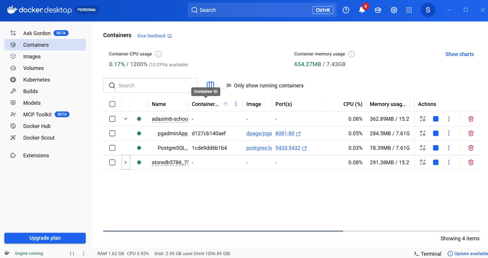
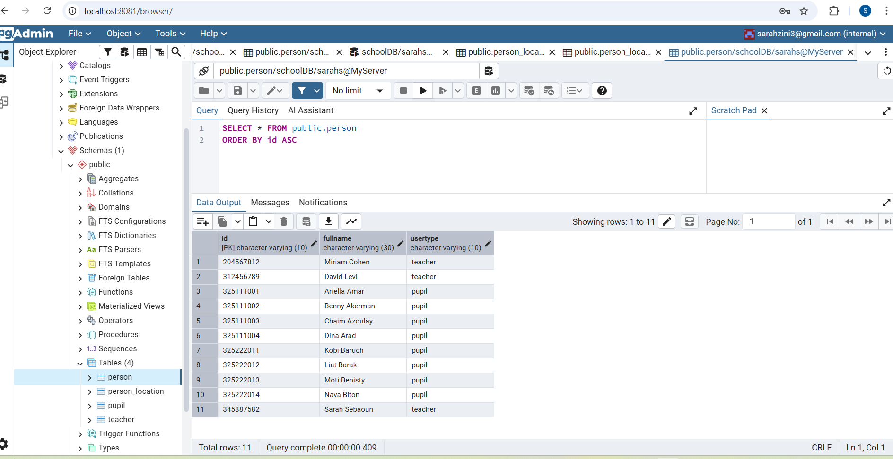
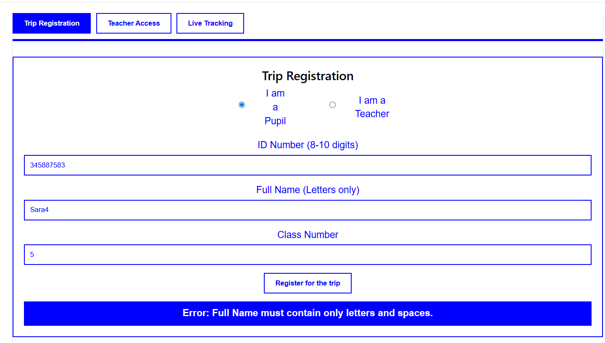
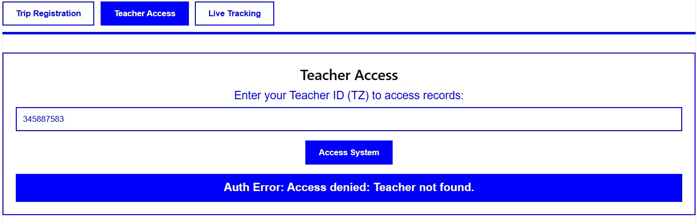
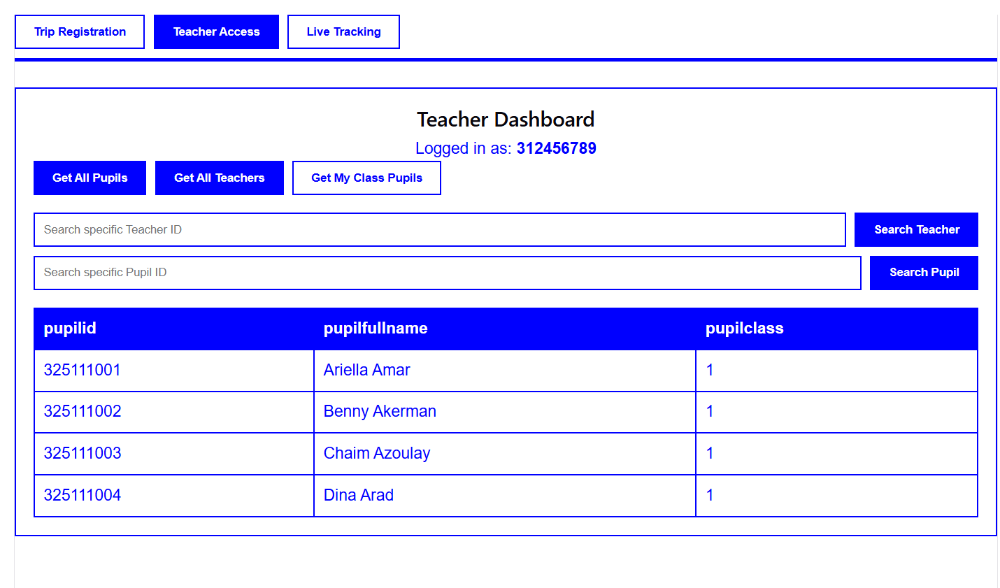
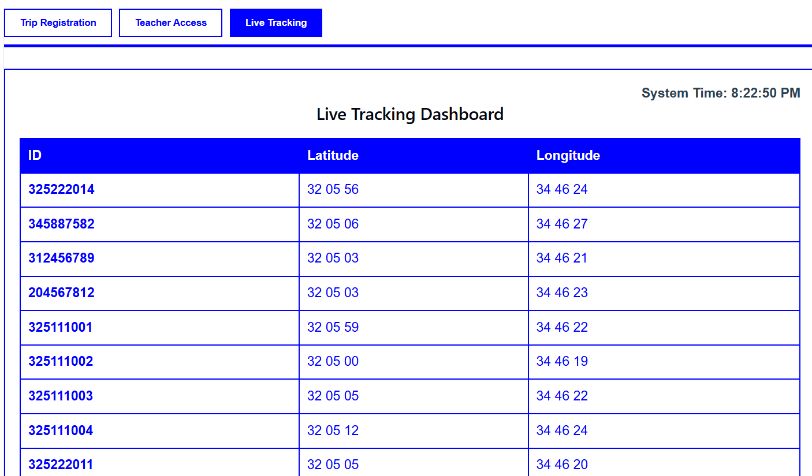
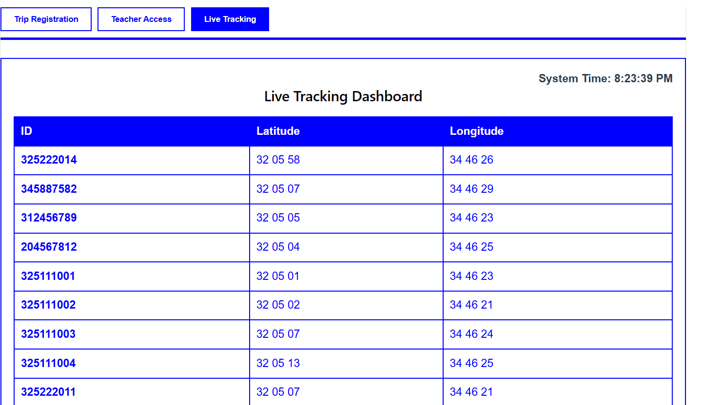

# Adasim6-school

# Trip Management System 

This project manages school trip registrations and real-time pupil tracking.

##  Implementation

*   **Backend**: Built with **Python (FastAPI)** to handle API requests.
*   **Frontend**: Developed with **React** for a dynamic user interface.
*   **Database**: **PostgreSQL** managed via **Docker** and **pgAdmin**.

## Personnal Choices

### Stage 1
*   **Data Inheritance**: Used a `PERSON` table to centralize IDs (TZ).
*   **No Duplicates**: This structure ensures unique and consistent records.
*   **Teacher Security**: One teacher maximum per class via `UNIQUE` constraints.
*   **Integer Classes**: Classes are stored as simple `INT` values.

### Stage 2
*   **DB**: I added a new table for person's location.
*   **External JSON Simulation**: Simulated an external JSON generation to handle data requirements.

### Bonus
*   **Coordinate Movement**: Used random values (0-4) for movement instead of distance formulas .

## Execution Examples

### 1. Registration & Validation
The system check inputs before sending data to the server.

### 2. Teacher Access
Secure login using the teacher's unique ID

### 3. Data Display
Every teacher that is connected can see his pupils

### 4. GPS Live Tracking Before and After

The images below show that the coordinates (Latitude and Longitude) change automatically every minute.
You can see the numbers update between the two screenshots, proving the simulation works. (simulation fct in backend/routers/locations)
I displayed the tracking in a table because I do not know how to integrate a visual map yet.

### 5.Bonus
Implemented in the back, not (yet) run

## How to Run

1.  **Database**: Start the PostgreSQL Docker container and run init-db.py (create and insert somedata).
2.  **Backend**: Run `uvicorn main:app --reload` (after activate venv with venv\Scripts\activate).
3.  **Frontend**: Run `npm start`.

**Note:** All frontend folders and dependencies were installed using `npm` to ensure the project runs correctly.
